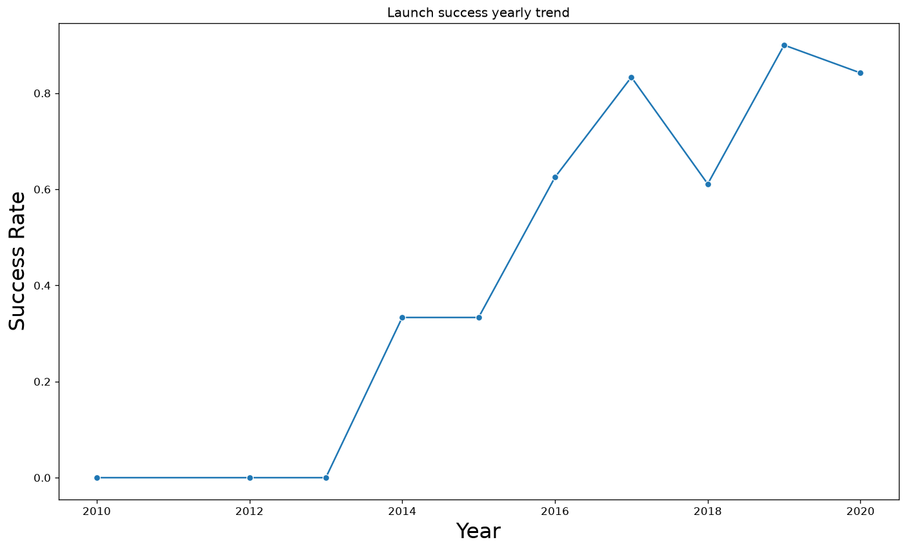
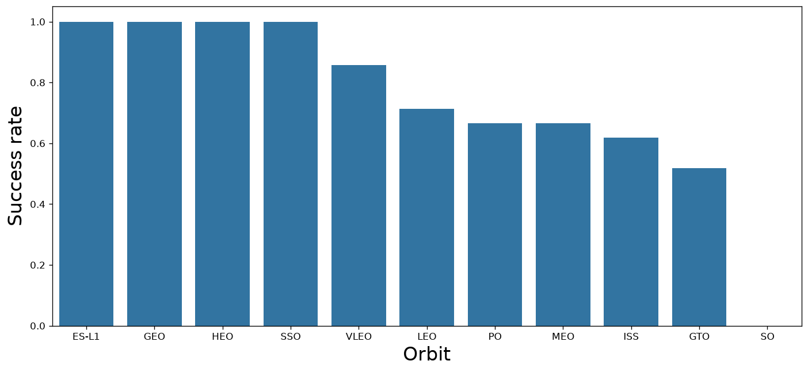
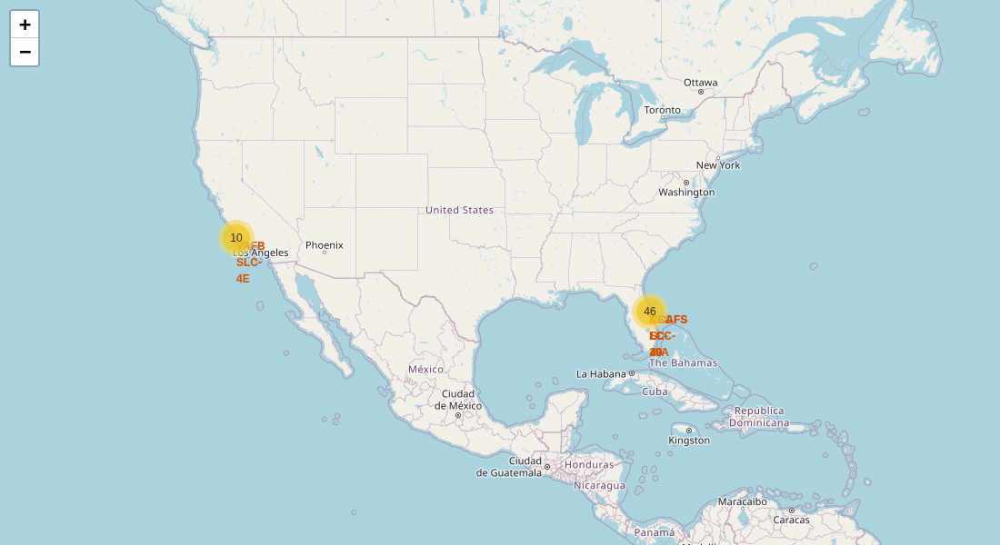
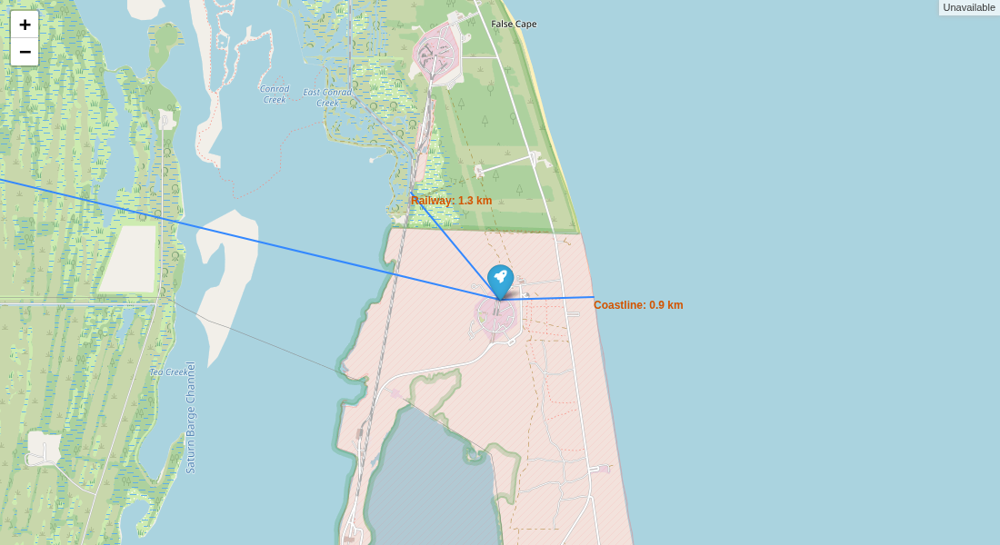
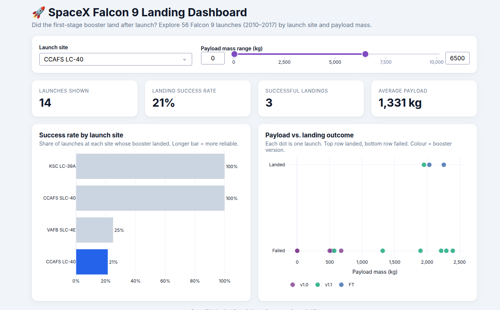
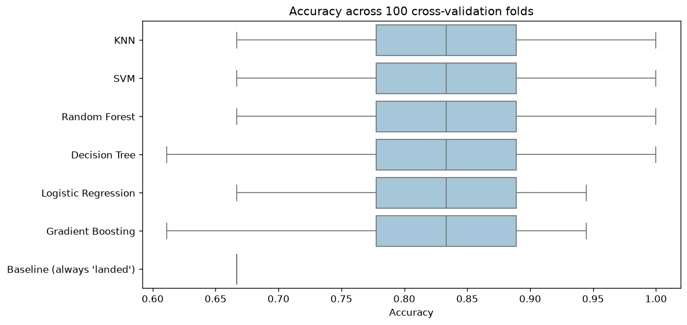
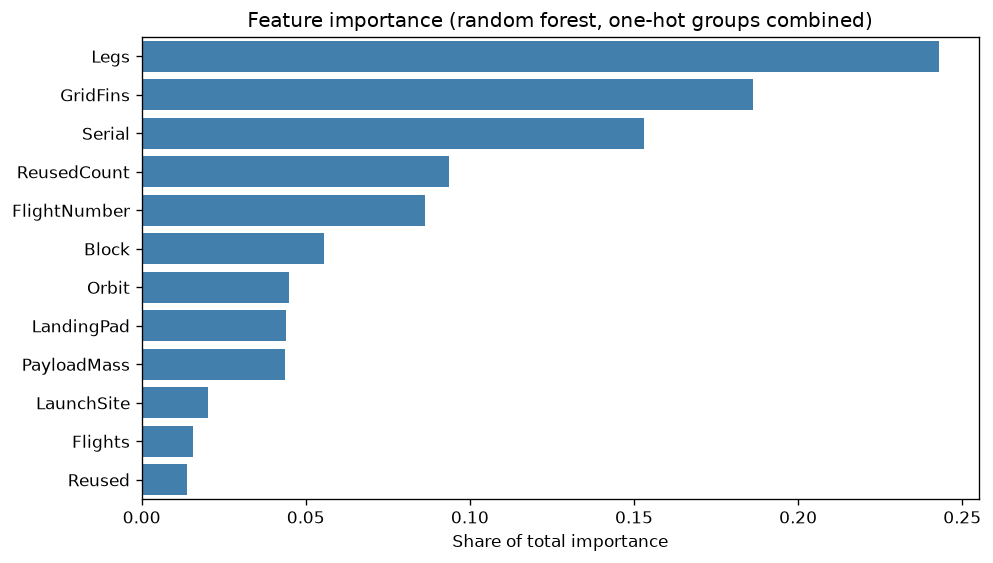

# SpaceX Falcon 9 Landing Prediction

**Can we predict whether a Falcon 9 first stage will land successfully, using only information known before launch?**

SpaceX advertises Falcon 9 launches at about **$62M**, compared with **$165M+** from other providers. Most of the saving comes from landing and reusing the first stage. A model that predicts landing success therefore helps estimate the cost of a launch, which matters to any competitor bidding against SpaceX.

This end-to-end data science project collects launch data from a REST API and from Wikipedia, cleans it, explores it with SQL, charts and interactive maps, publishes an interactive dashboard, and trains and evaluates classification models.

     

## Key results

| | |
|---|---|
| **Best cross-validated accuracy** | **~84%** (KNN and SVM), against a 67% "always predict landed" baseline |
| **Most predictive features** | Landing legs, grid fins, which booster flew and how often it had been reused |
| **Landing success over time** | 0% (2010–2013), then 33% (2014), then 84–90% (2019–2020) |
| **Best launch site** | KSC LC-39A, with 77% of its launches landing |

## Pipeline

```
SpaceX REST API ─┐
                 ├─► Data wrangling ─► EDA (SQL + charts) ─► Folium maps ─► ML models ─► Robust evaluation
Wikipedia (HTML) ┘                          │
                                            └─► Plotly Dash dashboard
```

| # | Notebook | What it does |
|---|----------|--------------|
| 01 | [Data collection (API)](notebooks/01_data_collection_api.ipynb) | Calls the SpaceX REST API, enriches launches with rocket, pad, payload and core details, and filters to Falcon 9 |
| 02 | [Web scraping](notebooks/02_web_scraping.ipynb) | Parses Wikipedia launch tables with BeautifulSoup |
| 03 | [Data wrangling](notebooks/03_data_wrangling.ipynb) | Handles missing values and builds the binary landing label |
| 04 | [EDA with SQL](notebooks/04_eda_sql.ipynb) | Runs 10 SQL queries against SQLite (payloads, boosters, outcome rankings) |
| 05 | [EDA with visualization](notebooks/05_eda_visualization.ipynb) | Charts success against flight number, payload, orbit, site and year, then one-hot encodes features |
| 06 | [Launch site maps](notebooks/06_launch_site_maps_folium.ipynb) | Maps sites and outcomes, and measures distances to the coast, railway and nearest city |
| 07 | [ML prediction](notebooks/07_ml_landing_prediction.ipynb) | Tunes logistic regression, SVM, decision tree and KNN with GridSearchCV |
| 08 | [Robust evaluation](notebooks/08_robust_evaluation_feature_importance.ipynb) | **Beyond the course:** repeated cross-validation, ensemble models, a baseline and feature importance |
| — | [Dashboard app](app/spacex_dash_app.py) | Interactive Plotly Dash app for exploring outcomes by site and payload |

## Findings

**SpaceX got much better at landing over time.** Success went from none of the early attempts to about 85–90% by 2019–2020. Flight number is a strong signal.



**Orbit matters.** SSO, HEO, GEO and ES-L1 missions landed every time, but those groups are tiny (1 to 5 launches each). GTO missions, which are heavy and high-energy, landed only about half the time.



**Launch sites are close to the coast and far from cities.** Every site is within about 1 km of the coastline and more than 20 km from the nearest city, so failures fall into the ocean away from people.




## Interactive dashboard

A Plotly Dash app ([`app/spacex_dash_app.py`](app/spacex_dash_app.py)) for exploring the launches yourself:

- **Filters:** choose a launch site and a payload mass range.
- **Summary cards:** launches shown, landing success rate, successful landings and average payload.
- **Success rate by launch site:** a bar chart that highlights the selected site.
- **Payload vs. landing outcome:** each launch plotted as *Landed* or *Failed*, coloured by booster version.



## Modeling: why a single test split is not enough

The course version scores the models on a test set of only **18 launches**, where one mistake moves accuracy by 5.6 points. In that split the decision tree had the *best* cross-validation score (87.5%) and the *worst* test score (66.7%). A split that small can't reliably rank models.

Notebook 08 re-evaluates every model with **5-fold cross-validation repeated 20 times** (100 fits per model), with scaling inside a pipeline so that no test data leaks into training:

| Model | Accuracy (mean ± std) | F1 | ROC AUC |
|---|---|---|---|
| KNN | 0.845 ± 0.073 | 0.893 | 0.844 |
| SVM | 0.844 ± 0.075 | 0.890 | 0.896 |
| Random Forest | 0.837 ± 0.071 | 0.884 | 0.875 |
| Decision Tree | 0.828 ± 0.087 | 0.870 | 0.814 |
| Logistic Regression | 0.826 ± 0.069 | 0.884 | 0.858 |
| Gradient Boosting | 0.823 ± 0.070 | 0.872 | 0.861 |
| Baseline (always "landed") | 0.667 | 0.800 | 0.500 |



**Takeaway:** every model beats the baseline by about 16–18 points, but they are statistically indistinguishable from each other. With 90 launches, more data would help far more than more tuning.



## Run it locally

```bash
git clone https://github.com/badrioumayma/IBM-Applied-Data-Science-Capstone.git
cd IBM-Applied-Data-Science-Capstone
python -m venv .venv && source .venv/bin/activate
pip install -r requirements.txt

jupyter notebook notebooks/          # the analysis
python app/spacex_dash_app.py        # the dashboard, at http://localhost:8050
```

The datasets are in [`data/`](data), so notebooks 02–08 run offline, except for the Wikipedia request in notebook 02. Notebook 01 calls the live SpaceX API.

Folium maps don't render on GitHub. To interact with them, view notebook 06 on [nbviewer](https://nbviewer.org/github/badrioumayma/IBM-Applied-Data-Science-Capstone/blob/main/notebooks/06_launch_site_maps_folium.ipynb).

## Deploy the dashboard

`render.yaml` is included. On [Render](https://render.com), choose **New → Blueprint** and point it at this repository. It serves the app with `gunicorn app.spacex_dash_app:server`.

## Project structure

```
├── app/spacex_dash_app.py     Plotly Dash dashboard
├── data/                      raw and processed datasets
├── images/                    charts and screenshots used in this README
├── notebooks/                 01–08, in pipeline order
├── requirements.txt
└── render.yaml                one-click dashboard deployment
```

## Acknowledgements

Built as the capstone of the [IBM Data Science Professional Certificate](https://www.coursera.org/professional-certificates/ibm-data-science) on Coursera. The lab templates and datasets are © IBM. Notebook 08, the refactored dashboard, and the fixes and write-ups across the notebooks are my own additions.
